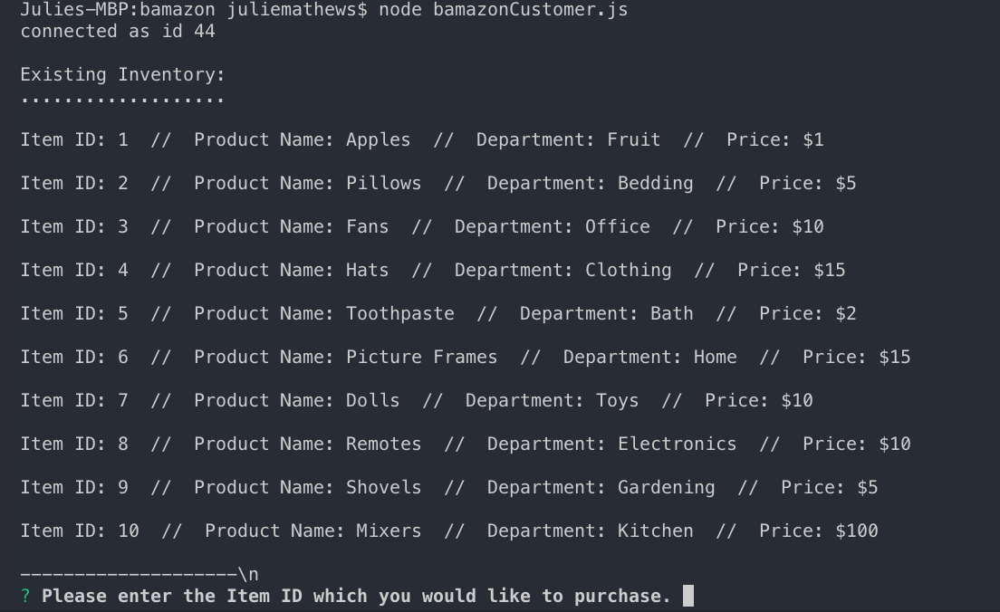
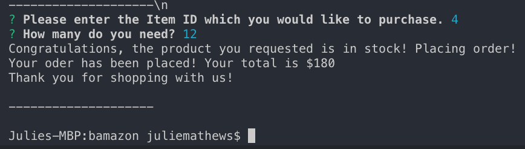
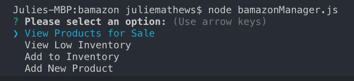
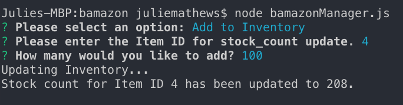
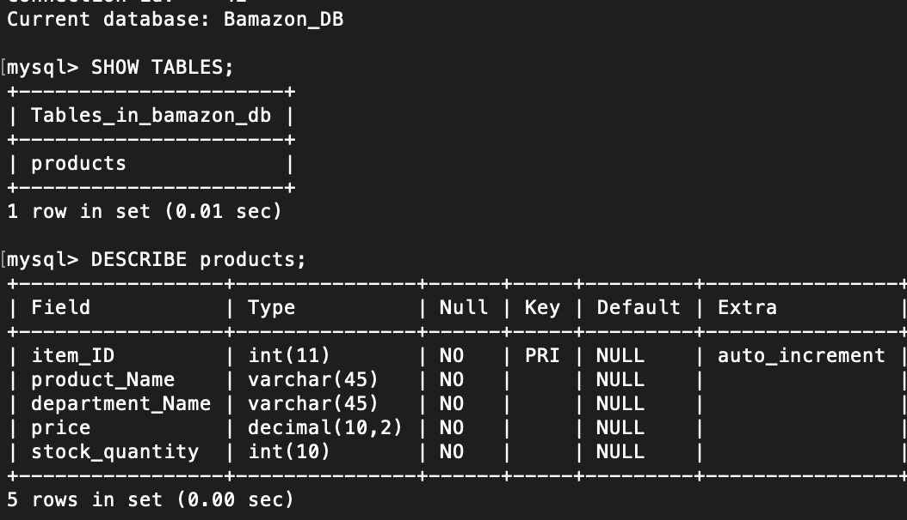

Amazon-like storefront with the MySQL skills. The app will take in orders from customers and deplete stock from the store's inventory.

This shows the existing inventory:

This is what the customer sees for what they can do:

This is what the manager sees and options they can choose:

Managers fulfilling a request:

The tables in Node:
